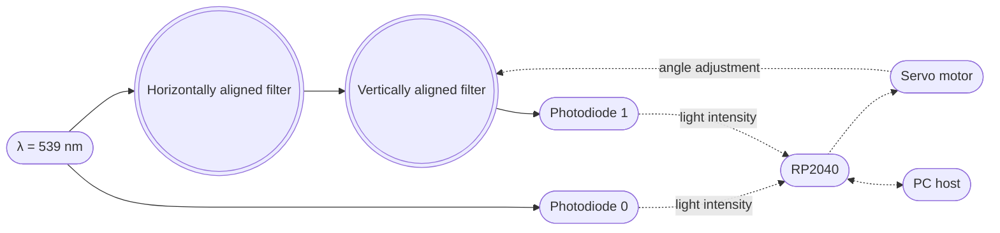


  
  


## Introduzione alle transaminasi

A polarimer is an instrument widely used in optics and chemistry for identifying the specific rotation of a molecule $[\alpha]^{20\degree C}_{D}$, hense its nature, and for measuring the concentration of a known compound.

## Produzione ricombinante e applicazioni delle biotecnologie

$$
[\alpha]^{20\degree C}_{D} = \cfrac{\alpha}{l \cdot c}
$$

## Requirements

| Hardware           | Quantity | Average price per unit | 
|--------------------|----------|------------------------|
| Polarizing filters | 2        | 2 €                    |
| Servo motors       | 2        | 2 €                    |
| Raspberry Pi Pico  | 1        | 5 €                    |
| USB cable          | 1        | 1 €                    |
| Photodiodes        | 2        | 1 €                    |

## Percorso di screening, produzione, sperimentazione

## Raspberry PI Pico Pinout

```mermaid
%%{ init : { "flowchart" : { "curve" : "linear" }}}%%

graph TB;

    rp2040(RP2040)

    pin1_UART0_TX[UART0 TX]  --- pin1_I2C0_SDA[I2C0 SDA]  --- pin1_SPI0_RX[SPI0 RX]    --- pin1_GP0[GP0]    ---   pin1[pin1]   --- rp2040
    pin2_UART0_RX[UART0 RX]  --- pin2_I2C0_SCL[I2C0 SCL]  --- pin2_SPI0_CSn[SPI0 CSn]  --- pin2_GP1[GP1]    ---   pin2[pin2]   --- rp2040
                                                                                           pin3_GND[GND]    ---   pin3[pin3]   --- rp2040
                                 pin4_I2C1_SDA[I2C1 SDA]  --- pin4_SPI0_SCK[SPI0 SCK]  --- pin4_GP2[GP2]    ---   pin4[pin4]   --- rp2040
                                 pin5_I2C1_SCL[I2C1 SCL]  --- pin5_SPI0_TX[SPI0 TX]    --- pin5_GP3[GP3]    ---   pin5[pin5]   --- rp2040
    pin6_UART1_TX[UART1 TX]  --- pin6_I2C0_SDA[I2C0 SDA]  --- pin6_SPI0_RX[SPI0 RX]    --- pin6_GP4[GP4]    ---   pin6[pin6]   --- rp2040
    pin7_UART1_RX[UART1 RX]  --- pin7_I2C0_SCL[I2C0 SCL]  --- pin7_SPI0_CSn[SPI0 CSn]  --- pin7_GP5[GP5]    ---   pin7[pin7]   --- rp2040
                                                                                           pin8_GND[GND]    ---   pin8[pin8]   --- rp2040
                                 pin9_I2C1_SDA[I2C1 SDA]  --- pin9_SPI0_SCK[SPI0 SCK]  --- pin9_GP6[GP6]    ---   pin9[pin9]   --- rp2040
                                 pin10_I2C1_SCL[I2C1 SCL] --- pin10_SPI0_TX[SPI0 TX]   --- pin10_GP7[GP7]   ---   pin10[pin10] --- rp2040
    pin11_UART1_TX[UART1 TX] --- pin11_I2C0_SDA[I2C0 SDA] --- pin11_SPI1_RX[SPI1 RX]   --- pin11_GP8[GP8]   ---   pin11[pin11] --- rp2040
    pin12_UART1_RX[UART1 RX] --- pin12_I2C0_SCL[I2C0 SCL] --- pin12_SPI1_CSn[SPI1 CSn] --- pin12_GP9[GP9]   ---   pin12[pin12] --- rp2040
                                                                                           pin13_GND[GND]   ---   pin13[pin13] --- rp2040
                                 pin14_I2C0_SDA[I2C1 SDA] --- pin14_SPI1_SCK[SPI1 SCK] --- pin14_GP10[GP10] ---   pin14[pin14] --- rp2040
                                 pin15_I2C0_SCL[I2C1 SCL] --- pin15_SPI1_TX[SPI1 TX]   --- pin15_GP11[GP11] ---   pin15[pin15] --- rp2040
    pin16_UART0_TX[UART0 TX] --- pin16_I2C0_SDA[I2C0 SDA] --- pin16_SPI1_RX[SPI1 RX]   --- pin16_GP12[GP12] ---   pin16[pin16] --- rp2040
    pin17_UART0_RX[UART0 RX] --- pin17_I2C0_SCL[I2C0 SCL] --- pin17_SPI1_CSn[SPI1 CSn] --- pin17_GP13[GP13] ---   pin17[pin17] --- rp2040
                                                                                           pin18_GND[GND]   ---   pin18[pin18] --- rp2040
    pin19_I2C1_SDA[I2C1 SDA] --- pin19_SPI1_SCK[SPI1 SCK] --- pin19_GP14[GP14] ---   pin19[pin19] --- rp2040
    pin20_I2C1_SCL[I2C1 SCL] --- pin20_SPI1_TX[SPI1 TX]   --- pin20_GP15[GP15] ---   pin20[pin20] --- rp2040

    rp2040 --- pin40[pin40] --- pin40_VBUS[VBUS]         
    rp2040 --- pin39[pin39] --- pin39_VSYS[VSYS]         
    rp2040 --- pin38[pin38] --- pin38_GND[GND]           
    rp2040 --- pin37[pin37] --- pin37_3V3_EN[3V3_EN]     
    rp2040 --- pin36[pin36] --- pin36_3V3_OUT[3V3_OUT]   
    rp2040 --- pin35[pin35] --- pin35_ADC_VREF[ADC_VREF] 
    rp2040 --- pin34[pin34] --- pin34_GP28[GP28]           ---  pin34_ADC2[ADC2]                       
    rp2040 --- pin33[pin33] --- pin33_GND[GND]             ---  pin33_AGND[AGND]                         
    rp2040 --- pin32[pin32] --- pin32_GP27[GP27]           ---  pin32_ADC1[ADC1] --- pin32_I2C1_SCL[I2C1 SCL]
    rp2040 --- pin31[pin31] --- pin31_GP26[GP26]           ---  pin31_ADC0[ADC0] --- pin31_i2C1_SDA[i2C1 SDA]
    rp2040 --- pin30[pin30] --- pin30_RUN[RUN]             
    rp2040 --- pin29[pin29] --- pin29_GP22[GP22]           
    rp2040 --- pin28[pin28] --- pin28_GND[GND]             
    rp2040 --- pin27[pin27] --- pin27_GP21[GP21]           ---  pin27_I2C0_SCL[I2C0 SCL]
    rp2040 --- pin26[pin26] --- pin26_GP20[GP20]           ---  pin26_I2C0_SDA[I2C0 SDA]
    rp2040 --- pin25[pin25] --- pin25_GP19[GP19]           ---  pin25_SPI0_TX[SPI0 TX]    ---  pin25_I2C1_SCL[I2C1 SCL]
    rp2040 --- pin24[pin24] --- pin24_GP18[GP18]           ---  pin24_SPI0_SCK[SPI0 SCK]  ---  pin24_I2C1_SDA[I2C1 SDA]
    rp2040 --- pin23[pin23] --- pin23_GND[GND]             
    rp2040 --- pin22[pin22] --- pin22_GP17[GP17]           ---  pin22_SPI0_CSn[SPI0 CSn]  ---  pin22_I2C0_SCL[I2C0 SCL] --- pin22_UART0_RX[UART0 RX]
    rp2040 --- pin21[pin21] --- pin21_GP16[GP16]           ---  pin21_SPI0_RX[SPI0 RX]    ---  pin21_I2C0_SDA[I2C0 SDA] --- pin21_UART0_TX[UART0 TX]

```

## Writing the code

## Setting up binaries

## Calibration